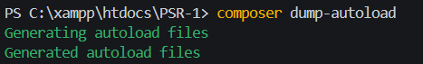
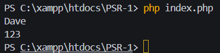

<p align="center">
  
</p>

## Laboratorio #4- Implementación de la Carga Automática (Autoload) bajo el Estándar PSR-4 con Composer.
El Autoload es un mecanismo en PHP que permite cargar clases automáticamente sin necesidad de utilizar instrucciones como require o include. Esto mejora la organización del código y evita errores como “Class not found”.
Mediante el uso de Composer y el estándar PSR-4, se establece una relación entre los namespaces y la estructura de carpetas del proyecto, permitiendo que las clases se carguen de forma dinámica cuando son necesarias.
En este laboratorio se implementa este enfoque, demostrando cómo el uso de Autoload facilita el desarrollo, mejora la mantenibilidad del sistema y promueve buenas prácticas en la programación.

## 🎯Objetivos del laboratorio

🔹 Comprender la importancia de la documentación en proyectos de desarrollo de software<br>
🔹 Aplicar el estándar PSR-4 para la organización de clases y namespaces.<br>
🔹 Configurar correctamente el archivo composer.json para implementar la carga automática.<br>
🔹 Evidenciar el uso de Composer en la gestión de dependencias y autoload.<br>
🔹 Demostrar el correcto funcionamiento del sistema evitando errores como Class not found.<br>

## ⚙️ Requisitos Previos

Para ejecutar este proyecto se requiere:

- PHP 8.2 o superior
- Composer (última versión)
- Autoload
- Bases de datos Mysql
- XAMPP (Apache y MySQL)

### 🌐 Tecnologías utilizadas

 
 
 
 
 


## 👩🏻‍💻Guía de Instalación
### Clonar el repositorio:
```bash
git clone https://github.com/wfranco09/PSR-4.git
```
### Acceder a la carpeta del proyecto:
```bash
cd autoload-psr4
```
### Instalar dependencias y generar el autoload:
```bash
composer install
```
### O en caso necesario:
```bash
composer dump-autoload
```

## Funcionamiento del Autoload y Clases

En este proyecto se implementa la carga automática de clases utilizando Composer bajo el estándar PSR-4, lo que permite instanciar clases sin necesidad de incluir archivos manualmente mediante require o include.

## El archivo principal (index.php) únicamente requiere el archivo:
```bash
require 'vendor/autoload.php';
```
Este archivo es generado automáticamente por Composer y se encarga de localizar e incluir las clases según el namespace definido en el archivo composer.json.

## Relación Namespace ↔ Ruta

El archivo composer.json define el mapeo entre namespaces y carpetas físicas:
```bash
"autoload": {
    "psr-4": {
        "App\\": "App/",
        "Database\\": "Database/"
    }
}
```
Esto significa que:
- App\User → App/User.php
- Database\model\ProductModel → Database/model/ProductModel.php

## Código de las Clases 
🔹 Clase User
```bash
namespace App;
class User {
    public function getName(): string
    {
        return "Dave";
    }
}
```
### Descripción:
Esta clase representa un usuario del sistema.
```bash
Función getName()
```
Retorna el nombre del usuario en formato de cadena (string).

🔹Clase ProductModel
```bash
namespace Database\model;

class ProductModel {
    public function getId(): int
    {
        return 123;
    }
}
```
### Descripción:
Esta clase simula un modelo de datos de producto.
```bash
Función getId()
```
Retorna el identificador del producto como un número entero (int)


## Uso en el sistema
En el archivo principal (index.php) se utilizan las clases de la siguiente manera:
```bash
use App\User;
use Database\model\ProductModel;

$user = new User();
echo $user->getName();

$product = new ProductModel();
echo $product->getId();

```
Gracias al autoload, no es necesario incluir manualmente los archivos de las clases.

## Nota
La carpeta `vendor/` no se incluye en el repositorio, ya que es generada automáticamente mediante Composer al ejecutar `composer install` o `composer dump-autoload`.

## Estructura de Carpetas
El proyecto sigue el estándar PSR-4, donde los namespaces están directamente relacionados con la estructura de carpetas:
```bash
autoload-psr4/
│
├── App/                          → Clases principales (Namespace: App)
│   └── User.php
│
├── Database/
│   └── model/                    → Modelos del sistema
│       └── ProductModel.php
│
├── imgs/                         → Recursos visuales (imágenes del README)
│
├── .gitignore                    → obligando a que la carga automática se genere localmente mediante Composer.
│
├── composer.json                 → Configuración de Composer (PSR-4)
└── index.php                     → Punto de entrada del sistema
```

## Relación clave:
```bash
Namespace: App\User  
Ruta física: App/User.php
```

## Pruebas de Ejecución - Imagenes
A continuación se muestran evidencias del correcto funcionamiento del sistema utilizando Composer Autoload bajo el estándar PSR-4.
### Generación del Autoload
Se ejecutó el comando para generar los archivos de carga automática:



Esto permite que Composer registre automáticamente las clases según su namespace y ruta definida.

### Ejecución del Sistema
Se ejecutó el archivo principal del proyecto:

 

Esta imagen demuestra que:
- Las clases fueron cargadas automáticamente
- No se utilizaron require manuales
- El sistema funciona correctamente sin errores de tipo Class not found

## Conclusiones Técnicas

### 🔹 Mantenibilidad
El uso de Composer Autoload permite nos agregar nuevas clases al proyecto sin necesidad de modificar manualmente múltiples archivos, lo que facilita la escalabilidad y organización del sistema.

### 🔹 Eficiencia de Memoria
Gracias al concepto de Lazy Loading, las clases se cargan únicamente cuando son necesarias, optimizando el uso de memoria y mejorando el rendimiento del sistema.

### 🔹 Estandarización
El uso del estándar PSR-4 proporciona una estructura clara y organizada, permitiendo que el proyecto sea más entendible y compatible con frameworks modernos como Laravel.


## Autor
**Winstron Franco**  
1GS131 - Desarrollo de Software VII 
Universidad Tecnológica de Panamá  

📧 **Email:** winston.franco@utp.ac.pa<br>
📧 **Email:** winstonfranco56@gmail.com<br>
🌐 **GitHub:** https://github.com/wfranco09<br>

**Instructor del Laboratorio::** Ing. Irina Fong

## Fecha de Ejecución del Laboratorio
5 de mayo 2026

